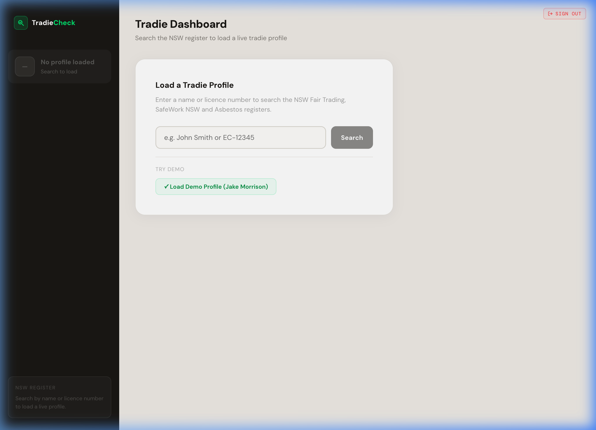
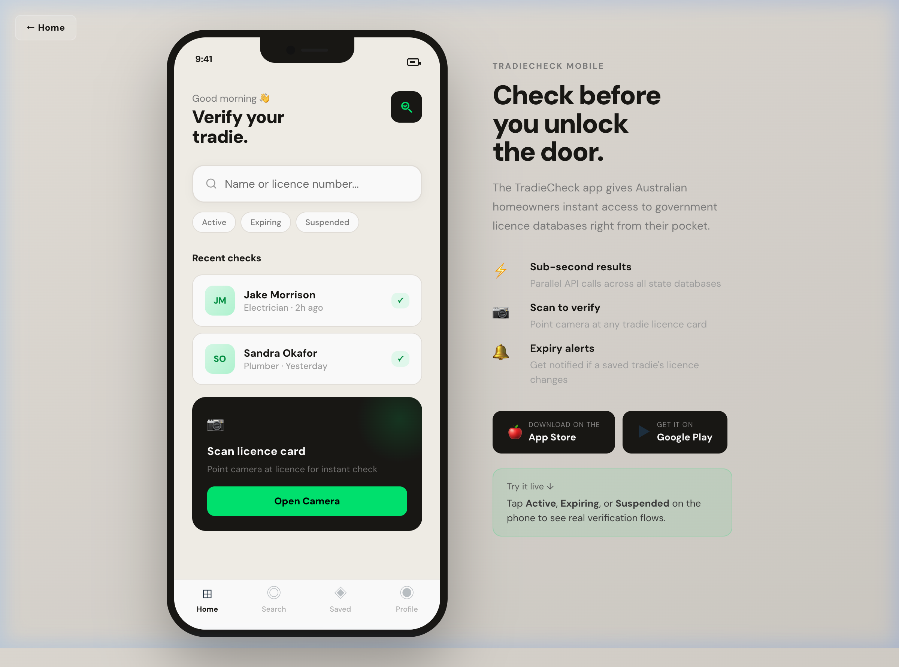
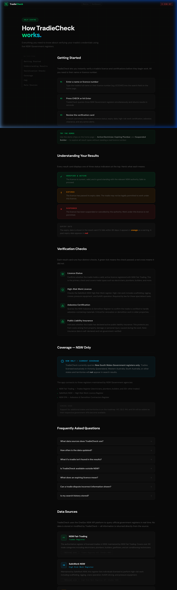

# TradieCheck

[](https://github.com/karunakarhv/tradiecheck/actions/workflows/test.yml)

Instantly verify Australian tradie licences, high-risk work certifications, and asbestos qualifications against live NSW Government registers.

Available on **Web**, **iOS**, and **Android**.


### Additional Views
<p align="center">
  
  
  
</p>


## Features

- **Live licence lookup** — searches NSW Fair Trading (Trades), SafeWork NSW (High Risk Work), and the Asbestos & Demolition Register in parallel
- **Instant status** — ACTIVE, EXPIRING, SUSPENDED, or EXPIRED with colour-coded verdicts
- **Demo records** — three built-in mock tradies for offline testing
- **Multiple views** — main search, tradie self-service dashboard, mobile app mockup, and NSW API config panel
- **Native iOS & Android app** — built with Capacitor, wraps the web app in a native shell with camera access for licence card scanning

## Tech Stack

| Layer | Technology |
|-------|-----------|
| Frontend | React 19, Vite 7, plain JavaScript |
| Backend | Express 5, Node.js |
| Mobile | Capacitor 7 (iOS + Android) |
| Auth | Supabase, NSW Government OAuth 2.0 client credentials |
| Unit tests | Vitest, @testing-library/react, happy-dom |
| E2E tests | Playwright (desktop Chromium, mobile-ios WebKit, mobile-android Chromium) |

---

## Prerequisites

### Web
- Node.js 18+
- npm 9+
- NSW Government API credentials (see [Getting API Keys](#getting-api-keys))

### iOS (additional)
- Mac with **Xcode 15+** installed ([Mac App Store](https://apps.apple.com/app/xcode/id497799835))
- CocoaPods — `brew install cocoapods`
- Apple Developer account ($99/year) for device testing and App Store submission

### Android (additional)
- **Android Studio** ([download](https://developer.android.com/studio))
- Android SDK with API level 22+ configured in Android Studio

---

## Setup

### 1. Clone the repo

```bash
git clone https://github.com/karunakarhv/tradiecheck.git
cd tradiecheck
```

### 2. Install dependencies

```bash
npm install
```

### 3. Configure environment variables

Create a `.env` file in the project root:

```bash
cp .env.example .env
```

Add your credentials:

```env
# Trades Licence API — NSW Fair Trading
TRADES_API_KEY=your_trades_consumer_key_here
TRADES_API_SECRET=your_trades_consumer_secret_here

# High Risk Work Register — SafeWork NSW
HRW_API_KEY=your_hrw_consumer_key_here
HRW_API_SECRET=your_hrw_consumer_secret_here

# Asbestos & Demolition Register — SafeWork NSW
ASBESTOS_API_KEY=your_asbestos_consumer_key_here
ASBESTOS_API_SECRET=your_asbestos_consumer_secret_here

# Supabase (frontend auth)
VITE_SUPABASE_URL=https://your-project.supabase.co
VITE_SUPABASE_ANON_KEY=your_anon_key_here

# API base URL — leave blank for web (same-origin); set for mobile builds
VITE_API_BASE_URL=
```

> The app still works without NSW API credentials — demo records (`LIC-48291`, `PLB-77432`, `BLD-10293`) are served from local mock data and don't require API access.

### 4. Run the development servers

Both servers must run simultaneously — the frontend proxies `/api/*` to the backend.

**Terminal 1 — Backend (port 3001):**
```bash
node server.js
```

**Terminal 2 — Frontend (port 5173):**
```bash
npm run dev
```

Open [http://localhost:5173](http://localhost:5173).

---

## Getting API Keys

1. Register at [api.nsw.gov.au/Account/Register](https://api.nsw.gov.au/Account/Register)
2. Create an app and subscribe to the following APIs:
   - **Trades Register API** (Product #25)
   - **High Risk Work Register API** (Product #33)
   - **Asbestos & Demolition Register API** (Product #34)
3. Copy the **Consumer Key** and **Consumer Secret** into `.env`

The NSW API uses OAuth 2.0 client credentials flow. The backend fetches and caches tokens automatically, refreshing them 60 seconds before expiry.

---

## Mobile App (iOS & Android)

TradieCheck uses [Capacitor](https://capacitorjs.com/) to wrap the web app in native iOS and Android containers. The same codebase runs on all three platforms — no separate UI rewrite required.

**Bundle ID:** `au.com.tradiecheck.app`

### Mobile build workflow

```bash
# 1. Create a mobile env file with your deployed backend URL
cp .env.example .env.mobile
# Edit .env.mobile and set VITE_API_BASE_URL=https://your-service.run.app

# 2. Build the web assets with mobile env vars
cp .env.mobile .env.local
npm run build:mobile

# 3. Sync the build into iOS and Android native projects
npm run cap:sync
```

> `VITE_API_BASE_URL` must point to a deployed backend (e.g. your GCP Cloud Run URL). Mobile apps cannot use relative `/api/check` calls like the web version — they need a full URL.

### Running on iOS

```bash
# Opens the Xcode workspace — press ▶ to run on Simulator or device
npm run cap:open:ios
```

After Xcode opens:
1. Select your development team under **Signing & Capabilities**
2. Choose a simulator or connected iPhone from the device menu
3. Press **▶ Run**

### Running on Android

```bash
# Opens Android Studio — click ▶ to run on emulator or device
npm run cap:open:android
```

After Android Studio opens, click **Run ▶** to run on the bundled emulator or a connected device.

### Regenerating app icons & splash screens

Source files live in `assets/`:
- `assets/icon.png` — 1024×1024 app icon (dark background, green shield)
- `assets/splash.png` — 2732×2732 splash screen

To regenerate all required sizes for both platforms:

```bash
npm run generate:assets
```

This writes directly into `ios/App/App/Assets.xcassets/` and `android/app/src/main/res/`.

### Camera (Scan licence card)

On iOS and Android, the "Open Camera" button in the mobile app triggers the native camera via `@capacitor/camera`. On the web, it shows an informational message. Camera permissions are declared in:
- **iOS:** `ios/App/App/Info.plist` (`NSCameraUsageDescription`)
- **Android:** `android/app/src/main/AndroidManifest.xml` (`CAMERA` permission)

### App Store & Play Store submission

| Store | Requirement |
|-------|-------------|
| Apple App Store | Apple Developer account ($99/yr), signing certificate + provisioning profile in Xcode |
| Google Play Store | Google Play Developer account ($25 one-time), signed APK/AAB from Android Studio |

---

## Deployment (Google Cloud Run)

TradieCheck is designed to deploy seamlessly to Google Cloud Run. The backend (`server.js`) natively serves the built frontend (`dist/`) statically, meaning no separate infrastructure is needed.

The deployed Cloud Run URL is what you set as `VITE_API_BASE_URL` in `.env.mobile` for mobile builds.

### 1. Manual Deployment

A native script `deploy-gcp.sh` is provided to deploy natively to Cloud Run from your terminal.

```bash
# Make it executable (only needed once)
chmod +x deploy-gcp.sh

# Deploy to Cloud Run
./deploy-gcp.sh
```

### 2. GitHub Actions (CI/CD)

The `.github/workflows/test.yml` pipeline automatically deploys your `main` branch directly to Cloud Run after running both Unit and E2E tests successfully.

To use the automated pipeline, configure the following secrets in your GitHub repository (**Settings → Secrets and variables → Actions**):
1. `GCP_CREDENTIALS` (Required): Your Google Cloud Service Account JSON Key with permissions to deploy to Cloud Run (`Editor` or `Cloud Run Admin`, `Cloud Build Editor`, `Artifact Registry Writer`).
2. `ENV_FILE_CONTENT` (Required): A `base64` string of your local `.env` file containing both your `VITE_` variables and backend API credentials. Run `cat .env | base64` locally to grab it.

---

## Routes

| URL | Description |
|-----|-------------|
| **Public Routes** | |
| `/login` | User authentication and login page |
| | |
| **Protected Routes** | *(Requires active session)* |
| `/` or `/welcome` | Landing / Welcome dashboard |
| `/verifyTradie` | Main verification lookup & search interface |
| `/dashboard` | Tradie self-service portal |
| `/mobile` | Mobile app UI mockup |
| `/help` | Help / Information page |
| `/api-config` | NSW API docs and credential config (if enabled in feature flags) |
| | |
| **Backend API** | |
| `/api/check?query={term}` | Express backend proxy to live NSW Government registers |

---

## Running Tests

### Unit tests

```bash
npm test              # run once
npm run test:watch    # watch mode during development
```

Tests use Vitest + Testing Library. Coverage includes utility functions (`parseNSWDate`, `NSW_STATUS`) and all shared components (`StarRating`, `CheckRow`, `StatusBadge`, `SourceIcon`).

### E2E tests

```bash
npm run test:e2e        # headless (auto-starts the dev server)
npm run test:e2e:ui     # interactive Playwright UI
```

Playwright runs three projects:

| Project | Browser | Tests |
|---------|---------|-------|
| `chromium` | Desktop Chrome | All tests except mobile |
| `mobile-ios` | WebKit (iPhone 12 viewport) | `mobile.spec.ts` only |
| `mobile-android` | Chromium (Pixel 5 viewport) | `mobile.spec.ts` only |

The mobile E2E tests cover all interactive flows in the `/mobile` route: HomeScreen rendering, Active/Expiring/Suspended verification flows, manual search, recent check taps, ResultScreen content, back navigation, and the ← Home link.

> **Note:** E2E tests use local mock data for the three demo codes (`LIC-48291`, `PLB-77432`, `BLD-10293`) and do not require NSW API credentials.

---

## Project Structure

```
tradiecheck/
├── capacitor.config.ts              # Capacitor config (bundle ID, webDir, plugins)
├── server.js                        # Express backend — NSW API proxy
├── assets/
│   ├── icon.png                     # Source app icon (1024×1024)
│   └── splash.png                   # Source splash screen (2732×2732)
├── ios/                             # Generated Xcode project (Capacitor)
│   └── App/
│       ├── App/
│       │   ├── Info.plist           # iOS permissions (camera, photo library)
│       │   └── Assets.xcassets/     # Auto-generated icons and splash screens
│       └── Pods/                    # CocoaPods dependencies
├── android/                         # Generated Android Studio project (Capacitor)
│   └── app/src/main/
│       ├── AndroidManifest.xml      # Android permissions (CAMERA)
│       └── res/                     # Auto-generated icons and splash screens
├── src/
│   ├── App.jsx                      # Manual router
│   ├── TradieCheck.jsx              # Main search page
│   ├── Dashboard.jsx                # Tradie dashboard
│   ├── Mobile.jsx                   # Mobile app mockup + camera integration
│   ├── hooks/
│   │   └── useTradieSearch.js       # Search logic (VITE_API_BASE_URL aware)
│   ├── components/                  # Shared UI components
│   │   ├── CheckRow.jsx
│   │   ├── SourceIcon.jsx
│   │   ├── StarRating.jsx
│   │   ├── StatusBadge.jsx
│   │   └── __tests__/
│   ├── lib/                         # Shared utilities and data
│   │   ├── nsw.js                   # NSW_STATUS map, parseNSWDate
│   │   ├── mockData.js              # Demo tradie records
│   │   └── __tests__/
│   └── test/
│       └── setup.js
├── e2e/
│   ├── tests/
│   │   ├── tradiecheck.spec.ts      # Main search E2E tests
│   │   ├── mobile.spec.ts           # Mobile mockup E2E tests (iOS + Android viewports)
│   │   ├── dashboard.spec.ts
│   │   ├── loginpage.spec.ts
│   │   ├── navigation.spec.ts
│   │   ├── help.spec.ts
│   │   ├── ratelimit.spec.ts
│   │   ├── multi-state.spec.ts
│   │   └── bulk.spec.ts
│   ├── pages/                       # Page object models
│   └── locators/                    # Element selector constants
├── playwright.config.ts             # Playwright config (chromium, mobile-ios, mobile-android)
└── vite.config.js                   # Vite config (build target es2015 for WebView compat)
```

---

## Available Scripts

| Command | Description |
|---------|-------------|
| `npm run dev` | Start Vite dev server (port 5173) |
| `npm run build` | Production web build |
| `npm run build:mobile` | Mobile build (then run `cap:sync`) |
| `npm run preview` | Preview production build |
| `npm run lint` | Run ESLint |
| `npm test` | Run unit tests once |
| `npm run test:watch` | Run unit tests in watch mode |
| `npm run test:e2e` | Run Playwright E2E tests (headless) |
| `npm run test:e2e:ui` | Run Playwright E2E tests (interactive UI) |
| `npm run cap:sync` | Sync web build into iOS and Android native projects |
| `npm run cap:open:ios` | Open Xcode |
| `npm run cap:open:android` | Open Android Studio |
| `npm run generate:assets` | Regenerate all icon and splash screen sizes |
