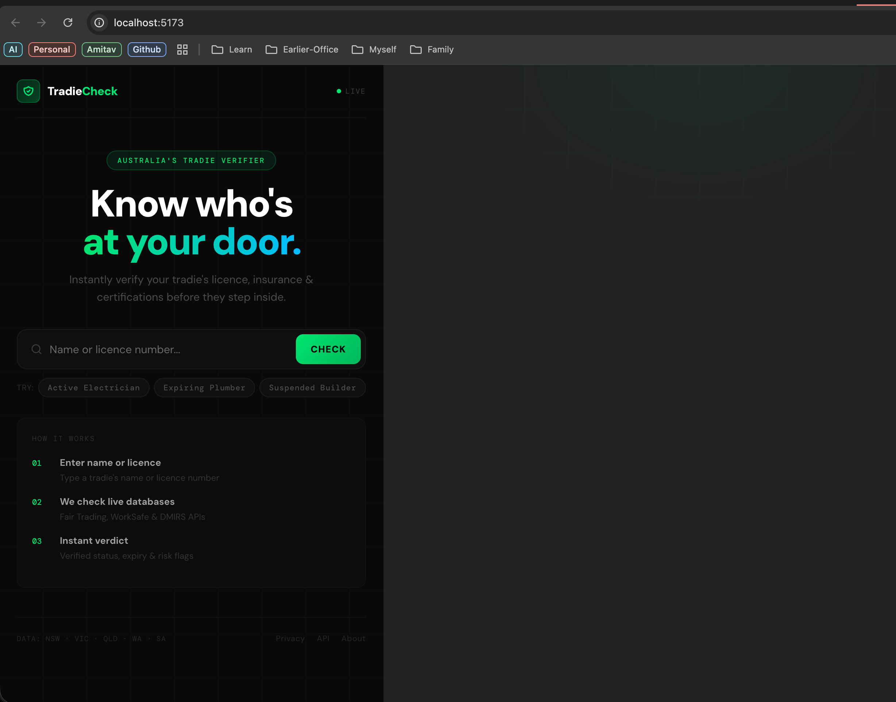

# TradieCheck

[](https://github.com/karunakarhv/tradiecheck/actions/workflows/test.yml)

Instantly verify Australian tradie licences, high-risk work certifications, and asbestos qualifications against live NSW Government registers.



## Features

- **Live licence lookup** — searches NSW Fair Trading (Trades), SafeWork NSW (High Risk Work), and the Asbestos & Demolition Register in parallel
- **Instant status** — ACTIVE, EXPIRING, SUSPENDED, or EXPIRED with colour-coded verdicts
- **Demo records** — three built-in mock tradies for offline testing
- **Multiple views** — main search, tradie self-service dashboard, mobile app mockup, and NSW API config panel

## Tech Stack

| Layer | Technology |
|-------|-----------|
| Frontend | React 19, Vite 7, plain JavaScript |
| Backend | Express 5, Node.js |
| Auth | NSW Government OAuth 2.0 client credentials |
| Tests | Vitest, @testing-library/react, happy-dom |

---

## Prerequisites

- Node.js 18+
- npm 9+
- NSW Government API credentials (see [Getting API Keys](#getting-api-keys))

---

## Setup

### 1. Clone the repo

```bash
git clone https://github.com/karunakarhv/tradiecheck.git
cd tradiecheck
```

### 2. Install dependencies

```bash
npm install
```

### 3. Configure environment variables

Create a `.env` file in the project root:

```bash
cp .env.example .env   # if the example exists, otherwise create it manually
```

Add your NSW API credentials:

```env
NSW_API_KEY=your_consumer_key_here
NSW_API_SECRET=your_consumer_secret_here
```

> The app still works without credentials — demo records (`LIC-48291`, `PLB-77432`, `BLD-10293`) are served from local mock data and don't require API access.

### 4. Run the development servers

Both servers must run simultaneously — the frontend proxies `/api/*` to the backend.

**Terminal 1 — Backend (port 3001):**
```bash
node server.js
```

**Terminal 2 — Frontend (port 5173):**
```bash
npm run dev
```

Open [http://localhost:5173](http://localhost:5173).

---

## Getting API Keys

1. Register at [api.nsw.gov.au/Account/Register](https://api.nsw.gov.au/Account/Register)
2. Create an app and subscribe to the following APIs:
   - **Trades Register API** (Product #25)
   - **High Risk Work Register API** (Product #33)
   - **Asbestos & Demolition Register API** (Product #34)
3. Copy the **Consumer Key** and **Consumer Secret** for your app into `.env`

The NSW API uses OAuth 2.0 client credentials flow. The backend fetches and caches tokens automatically, refreshing them 60 seconds before expiry.

---

## Routes

| URL | Description |
|-----|-------------|
| `/` | Main licence search |
| `/dashboard` | Tradie self-service portal |
| `/mobile` | Mobile app UI mockup |
| `/api-config` | NSW API docs and credential config |

---

## Running Tests

```bash
npm test
```

Tests use Vitest + Testing Library. Coverage includes utility functions (`parseNSWDate`, `NSW_STATUS`) and all shared components (`StarRating`, `CheckRow`, `StatusBadge`, `SourceIcon`).

```bash
npm run test:watch   # watch mode during development
```

---

## Project Structure

```
tradiecheck/
├── server.js                        # Express backend — NSW API proxy
├── src/
│   ├── App.jsx                      # Manual router
│   ├── TradieCheck.jsx              # Main search page
│   ├── TradieCheck-Dashboard.jsx    # Tradie dashboard
│   ├── TradieCheck-Mobile.jsx       # Mobile mockup
│   ├── TradieCheck-NSW-API-Config.jsx
│   ├── components/                  # Shared UI components
│   │   ├── CheckRow.jsx
│   │   ├── SourceIcon.jsx
│   │   ├── StarRating.jsx
│   │   ├── StatusBadge.jsx
│   │   └── __tests__/
│   ├── lib/                         # Shared utilities and data
│   │   ├── nsw.js                   # NSW_STATUS map, parseNSWDate
│   │   ├── mockData.js              # Demo tradie records
│   │   └── __tests__/
│   └── test/
│       └── setup.js
└── vite.config.js
```

---

## Available Scripts

| Command | Description |
|---------|-------------|
| `npm run dev` | Start Vite dev server (port 5173) |
| `npm run build` | Production build |
| `npm run preview` | Preview production build |
| `npm run lint` | Run ESLint |
| `npm test` | Run tests once |
| `npm run test:watch` | Run tests in watch mode |
